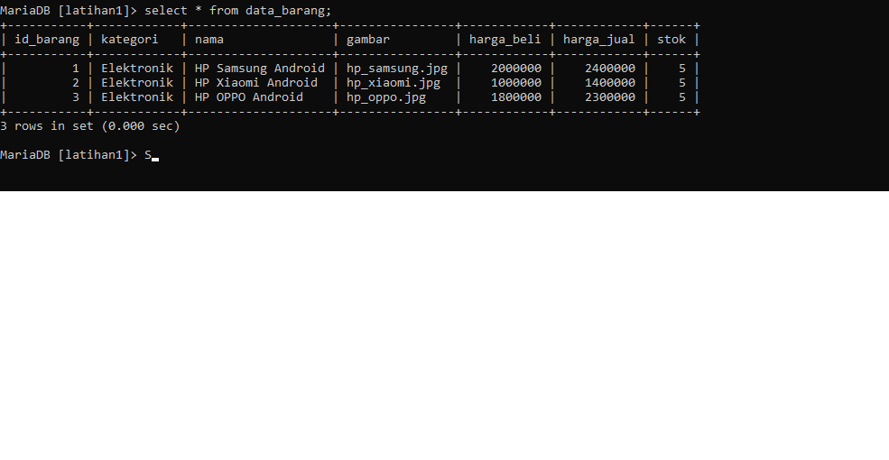
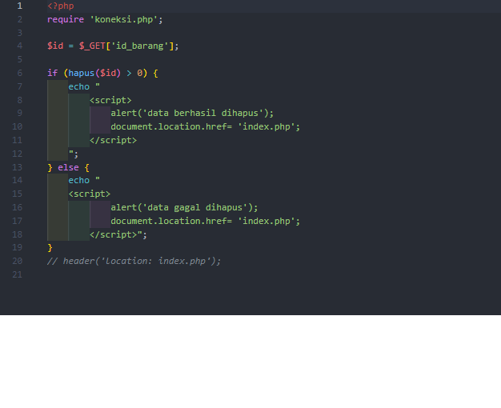

    Nama  : Marlina Horo
    Nim   : 312010250
    kelas : Ti 20 A2

1. Membuat nama database

2. Membuat tabel database

     

3. Menambahkan Data ke database

    

4. membuat file index

    

    

5. hasil

    

6. membuat file delete

     

